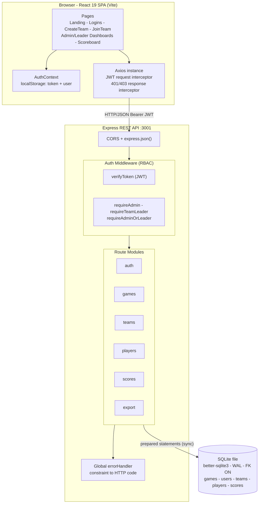
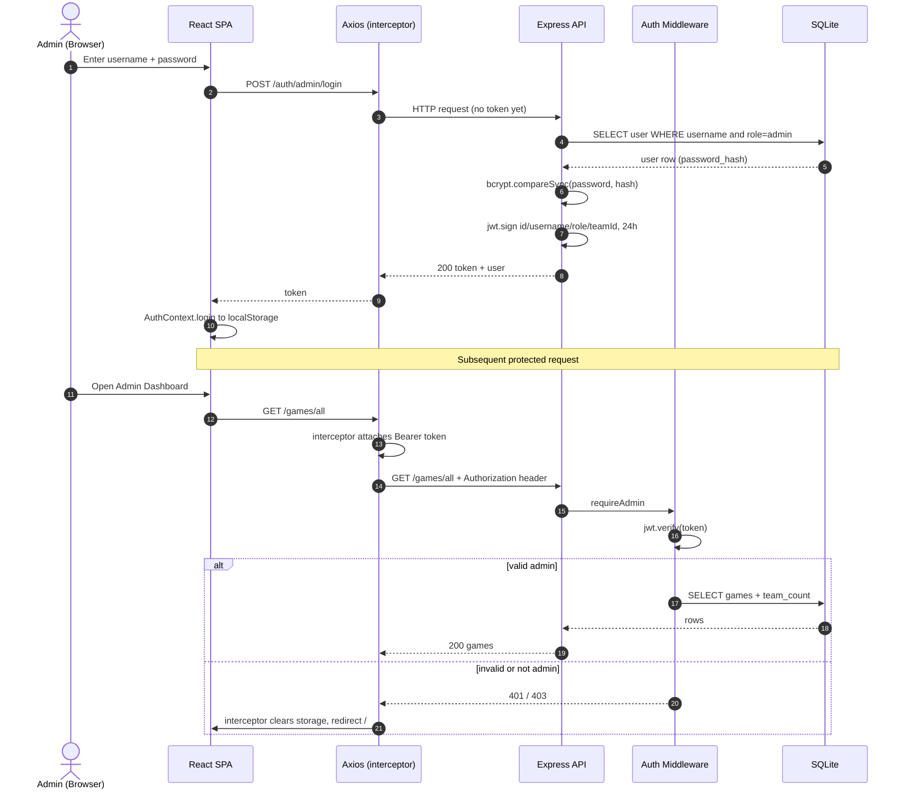
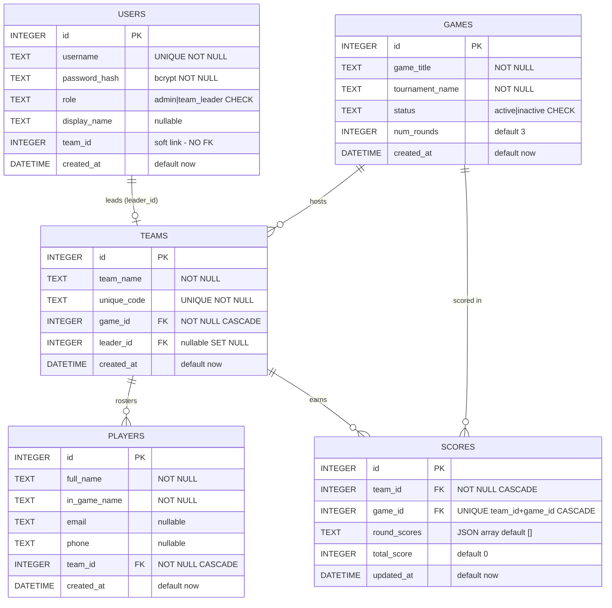
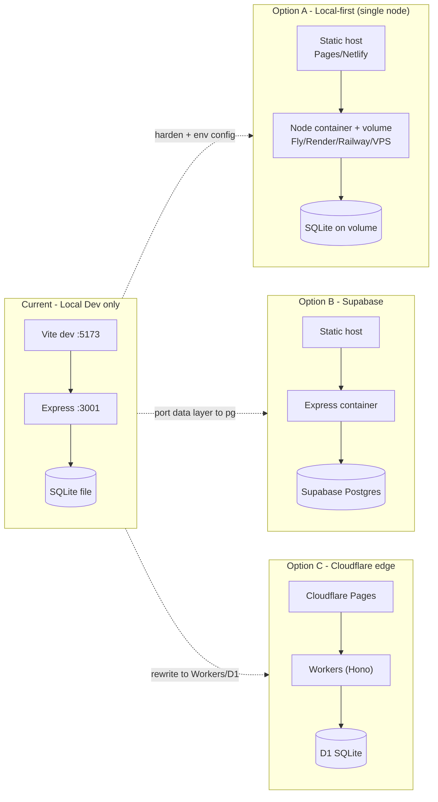

# ggBoard — Architecture

> **Status:** Living document · **As-of commit:** `ef2590d` (branch `beta`)
> **Scope:** Describes the system *as it actually exists in code today*. No code changes are implied by this document. All Mermaid diagrams below are syntax-validated.

ggBoard is a full-stack **esports tournament management** platform: an admin configures games/tournaments, the public registers teams and joins them, the admin records round scores, and a public leaderboard ranks teams live.

---

## 1. Tech stack

| Layer | Technology | Notes |
|---|---|---|
| Frontend | React 19, React Router 7, Vite 8 | SPA, dark neon theme, vanilla CSS |
| HTTP client | Axios | Single instance, JWT request interceptor, 401/403 response interceptor |
| Backend | Node.js + Express 4 | REST, route-per-resource, **raw inline SQL** in handlers |
| Database | SQLite via `better-sqlite3` 12 | Single local file, **synchronous** API, WAL mode, `foreign_keys = ON` |
| Auth | JWT (`jsonwebtoken`) + `bcryptjs` | Stateless 24h tokens, RBAC middleware |
| Config | `dotenv` | All vars have fallbacks; **no `.env` currently on disk** |

**Topology:** classic 2-tier client–server, **fully local**. The defining architectural constraint is that `better-sqlite3` is a synchronous native module backed by a single file on a local filesystem — it cannot run on serverless/edge runtimes and is single-node by nature.

---

## 2. Component / container view

**Backend entry point:** [`server.js`](backend/server.js) wires CORS → `express.json()` → route modules → 404 → global error handler. There is **no service/repository layer** — SQL, validation, and HTTP concerns all live together inside each route handler.

---

## 3. Runtime: auth & RBAC request lifecycle

### Authorization model
- **Token claims:** `{ id, username, role, teamId }`, signed with `JWT_SECRET`, 24h expiry ([`middleware/auth.js`](backend/middleware/auth.js)).
- **Role guards:** `requireAdmin`, `requireTeamLeader`, `requireAdminOrLeader` all wrap `verifyToken`.
- **Ownership checks (defense in depth):** for shared routes, handlers additionally compare `req.user.teamId` to the target resource — e.g. a team leader may only edit/delete players in their own team ([`players.js:156`](backend/routes/players.js#L156), [`players.js:193`](backend/routes/players.js#L193)) and only edit their own team ([`teams.js:202`](backend/routes/teams.js#L202)).
- **Logout is stateless** — the server simply 200s; the client discards the token. There is no revocation list, so a leaked token is valid until expiry.
- **Client guard:** `<ProtectedRoute requiredRole>` in [`App.jsx`](frontend/src/App.jsx) gates dashboard routes; auth state is restored from `localStorage` on mount **without re-validating the token** against the server.

### Distinctive flow — team creation auto-generates a leader account
`POST /teams/create` is **public** and, in a single transaction ([`teams.js:86`](backend/routes/teams.js#L86)), it: creates a `team_leader` user with a generated username + random password, creates the team with a unique join code, links the two, and seeds an empty score row. The generated credentials are returned **once** in the response body.

---

## 4. Data model

Source of truth: [`schema.sql`](backend/database/schema.sql). Notable design decisions and caveats:

- **`scores.round_scores` is a JSON string** in a `TEXT` column — flexible (any number of rounds without schema change) but not relationally queryable; per-round aggregation must happen in app code.
- **`scores.total_score` is denormalized** — it is recomputed and rewritten by the app on every `POST /scores/update` ([`scores.js:31`](backend/routes/scores.js#L31)). Nothing at the DB level keeps it consistent with `round_scores`.
- **`scores` has `UNIQUE(team_id, game_id)`** — one score row per team per game; the update route upserts against it.
- **`users.team_id` has no `FK` constraint** — it is a soft back-pointer. The enforced FK is `teams.leader_id → users.id (ON DELETE SET NULL)`. The user→team link relies on app code to stay correct.
- **Cascades:** deleting a game cascades to its teams, players, and scores; deleting a team cascades to its players and scores and (in app code) also deletes the leader user ([`teams.js:233`](backend/routes/teams.js#L233)).
- Indexes cover the hot lookup paths (`unique_code`, `team_id`, `game_id`, `role`, composite `team_id+game_id`).

---

## 5. API surface

Base URL `http://localhost:3001` (hardcoded in [`frontend/src/utils/api.js`](frontend/src/utils/api.js#L8)). Auth levels: **Public**, **Admin**, **Leader**, **Admin/Leader** (role + ownership check).

| Method | Path | Auth | Purpose |
|---|---|---|---|
| GET | `/health` | Public | Liveness check |
| POST | `/auth/admin/login` | Public | Admin login → JWT |
| POST | `/auth/leader/login` | Public | Team-leader login → JWT |
| POST | `/auth/logout` | Public | Stateless (client discards token) |
| POST | `/games/create` | Admin | Create game/tournament |
| GET | `/games/all` | Admin | All games + team counts |
| GET | `/games/active` | Public | Active games (registration dropdowns) |
| PATCH | `/games/:id` | Admin | Update game (COALESCE partial) |
| DELETE | `/games/:id` | Admin | Delete game (cascades) |
| POST | `/teams/create` | **Public** | Create team + auto-gen leader account + seed score (txn); returns generated creds |
| GET | `/teams/all` | Admin | All teams + leader + player counts |
| GET | `/teams/my` | Leader | Own team + roster |
| PATCH | `/teams/:id` | Admin/Leader | Update team (leader: own only) |
| DELETE | `/teams/:id` | Admin | Delete team + leader user |
| POST | `/players/join` | Public | Join a team by `unique_code` (dup check) |
| POST | `/players/add` | Admin | Add player to any team |
| GET | `/players/all` | Admin | All players (filters: `team_id`, `game_id`, `search`) |
| PATCH | `/players/:id` | Admin/Leader | Edit player (leader: own team only) |
| DELETE | `/players/:id` | Admin/Leader | Remove player (leader: own team only) |
| POST | `/scores/update` | Admin | Upsert `round_scores[]`, recompute total |
| GET | `/scores/:gameId` | Public | Ranked scoreboard for a game |
| POST | `/export` | Admin | CSV export (`players` \| `scores` \| `combined`), optional `game_id`, field selection |

> **Doc/code drift:** the header comment in [`teams.js`](backend/routes/teams.js#L7) advertises a `PATCH /teams/my`, but no such route is registered — team updates go through `PATCH /teams/:id` with an ownership check. Flagged in the risk register below.

---

## 6. Cross-cutting concerns

- **DB access:** a single lazily-initialized `better-sqlite3` connection ([`config/db.js`](backend/config/db.js)) shared process-wide; WAL + FK pragmas set on first open.
- **Transactions:** used where multiple writes must be atomic (team creation). Single-statement writes rely on SQLite's implicit transaction.
- **Error handling:** a global [`errorHandler`](backend/middleware/errorHandler.js) maps SQLite `UNIQUE`/`FOREIGN KEY` constraint failures to `409`/`400` and hides internals when `NODE_ENV=production`.
- **SQL safety:** all queries use parameterized prepared statements — no string interpolation of user input.
- **Config:** every env var (`PORT`, `JWT_SECRET`, `FRONTEND_URL`, `DB_PATH`, `NODE_ENV`) has an in-code fallback, so the app boots with zero config — convenient for dev, dangerous for prod (see P0 below).

---

## 7. Architectural risk register

| Sev | Issue | Location | Impact |
|---|---|---|---|
| 🔴 P0 | `JWT_SECRET` falls back to the public string `'fallback_secret'`; no `.env` exists and no startup assertion | [`auth.js:9`](backend/middleware/auth.js#L9) | Anyone can forge a valid admin token → full auth bypass |
| 🔴 P0 | Frontend API base URL hardcoded to `localhost:3001` | [`api.js:8`](frontend/src/utils/api.js#L8) | App can't be deployed anywhere but local without editing source |
| 🟠 P1 | No migration system — schema applied once via `CREATE TABLE IF NOT EXISTS` | [`seed.js`](backend/database/seed.js) | Schema changes can't be applied safely to an existing DB |
| 🟠 P1 | No validation layer — ad-hoc `if (!field)` checks, inconsistent | all routers | Weak/uneven input enforcement; no type coercion |
| 🟡 P2 | No rate limiting on `/auth/*` | [`auth.js`](backend/routes/auth.js) | Login brute-force exposure |
| 🟡 P2 | No data-access layer — raw SQL inline in handlers | all routers | Hurts testability; makes any DB swap painful |
| 🟡 P2 | `better-sqlite3` sync + single local file | [`config/db.js`](backend/config/db.js) | Single-node only; can't run serverless/edge |
| 🟡 P2 | Token restored from `localStorage` without server re-validation | [`AuthContext.jsx`](frontend/src/context/AuthContext.jsx) | Expired token shows "authenticated" until first API 401 |
| 🟡 P2 | `users.team_id` has no FK constraint | [`schema.sql:26`](backend/database/schema.sql#L26) | User↔team integrity depends entirely on app code |
| ⚪ P3 | Doc/code drift: `PATCH /teams/my` documented but not implemented | [`teams.js:7`](backend/routes/teams.js#L7) | Misleading; confuses API consumers |

> The **P0/P1** items are prerequisites for *any* deployment target and should be fixed regardless of the path chosen in §8.

---

## 8. Deployment — current state vs options

| Option | Effort | Rewrite scope | Best when |
|---|---|---|---|
| **A. Local-first** | Low | None | Ship/demo simply; keep all current code |
| **B. Supabase (Postgres)** | Medium | Data layer (`better-sqlite3` sync → `pg` async + SQL dialect) | Want a managed cloud DB with the smallest delta from today |
| **C. Cloudflare edge** | High | Backend + auth + data (`bcryptjs` unsupported on Workers; Express → Hono; sync → async D1) | Want edge scale / modern serverless and accept a rewrite |

> **Clerk note:** managed auth is an awkward fit here because the admin *auto-generates* team-leader credentials server-side ([`teams.js:55`](backend/routes/teams.js#L55)); Clerk assumes user self-signup. Not recommended unless that flow is redesigned.

---

## 9. Architecture decision log

- **ADR-001 — Document the architecture before changing it.** *Accepted.* Before committing to a deployment/data target, capture the as-built system, data model, API surface, and risks (this document). Rationale: avoid premature migration; make the trade-offs in §8 explicit first.
- **ADR-002 — Target architecture.** *Open.* Choose between Options A/B/C in §8. Gating factor: the `better-sqlite3` single-node constraint (P2). P0/P1 hardening proceeds regardless.

---

## 10. Open questions

1. What is the deployment goal — demo/portfolio, or a production tournament service? (Drives A vs B/C.)
2. Expected concurrency / number of simultaneous tournaments? (Drives whether single-node SQLite is sufficient.)
3. Should team-leader credentials remain admin-generated, or move to self-signup? (Drives whether managed auth like Clerk is viable.)
4. Is real-time scoreboard update (polling/WebSockets) in scope for the target architecture?