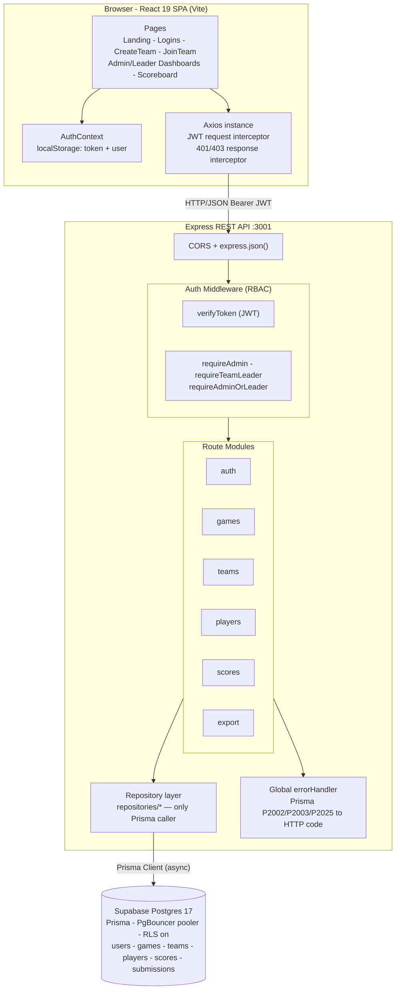
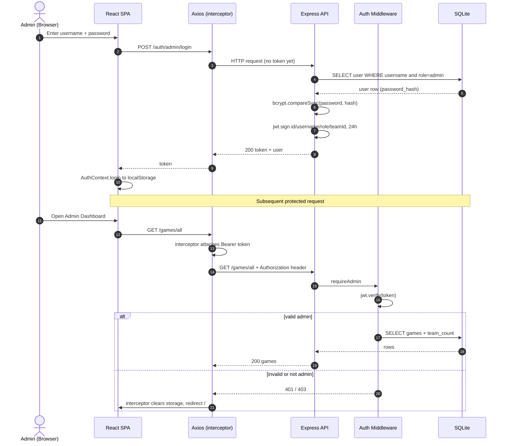
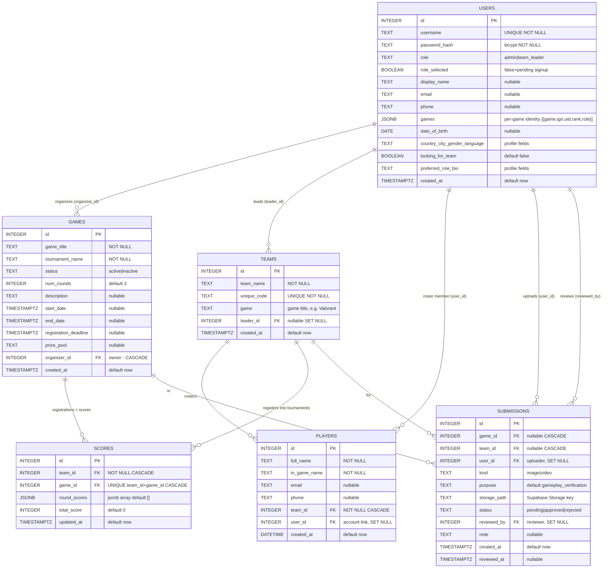
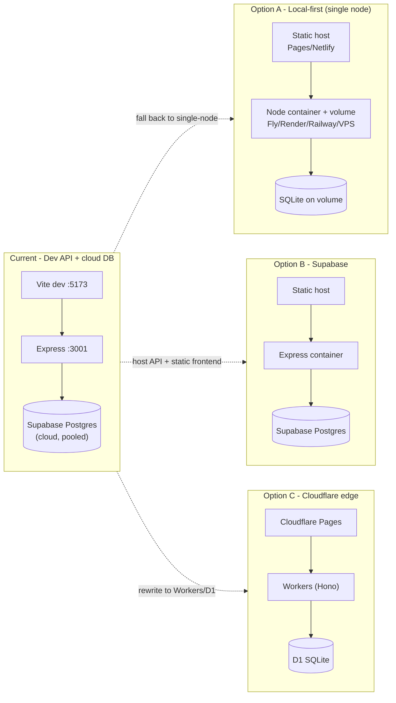

# ggBoard — Architecture

> **Status:** Living document · **As-of branch:** `beta` (Supabase/Prisma + decoupled teams, multi-team players, event feed, profiles, UI overhaul — ADR-006…010)
> **Scope:** Describes the system *as it actually exists in code today*. No code changes are implied by this document. All Mermaid diagrams below are syntax-validated.

ggBoard is a full-stack **esports tournament management** platform: an admin configures games/tournaments, the public registers teams and joins them, the admin records round scores, and a public leaderboard ranks teams live.

---

## 1. Tech stack

| Layer | Technology | Notes |
|---|---|---|
| Frontend | React 19, React Router 7, Vite 8 | SPA, dark neon theme, vanilla CSS |
| HTTP client | Axios | Single instance, JWT request interceptor, 401/403 response interceptor |
| Backend | Node.js + Express 4 | REST, route-per-resource, **async handlers over a repository layer** |
| Database | **Supabase Postgres 17** via **Prisma 6** | Managed cloud Postgres (Tokyo); PgBouncer pooler at runtime, direct connection for migrations; RLS enabled |
| Data access | Prisma Client + repository layer ([`repositories/`](backend/repositories/index.js)) | Only module that touches the DB — keeps a future engine swap contained |
| Auth | JWT (`jsonwebtoken`) + `bcryptjs` | Stateless 24h tokens, RBAC middleware |
| Config | `dotenv` | `.env` holds `DATABASE_URL`/`DIRECT_URL`/`JWT_SECRET`; server refuses to boot without required secrets |

**Topology:** classic 2-tier client–server backed by a **managed cloud database** (Supabase Postgres, Tokyo region). The API reaches Postgres through Prisma over Supabase's transaction pooler (PgBouncer, IPv4-friendly); the direct connection is reserved for schema migrations. Because the API layer is now stateless over a network database, it can scale horizontally and is serverless/edge-friendly — the previous single-node `better-sqlite3` constraint is resolved (see ADR-006).

---

## 2. Component / container view

**Backend entry point:** [`server.js`](backend/server.js) wires CORS → `express.json()` → rate limiting → route modules → 404 → global error handler. Persistence is delegated to a **repository layer** ([`repositories/index.js`](backend/repositories/index.js)) — the only module that imports Prisma — so handlers issue domain calls (`teams.createForPlayer(...)`) instead of SQL. Validation (Zod) and HTTP concerns stay in the handlers; async errors are forwarded to the error handler via an [`asyncHandler`](backend/utils/asyncHandler.js) wrapper.

---

## 3. Runtime: auth & RBAC request lifecycle

### Authorization model
- **Token claims:** `{ id, username, role, teamId }`, signed with `JWT_SECRET`, 24h expiry ([`middleware/auth.js`](backend/middleware/auth.js)).
- **Role guards:** `requireAdmin`, `requireTeamLeader`, `requireAdminOrLeader` all wrap `verifyToken`.
- **Multi-tenant (organizers):** the `admin` role is per-organizer — admins self-register via `POST /auth/admin/register`, and every admin management query is filtered/guarded by `games.organizer_id = req.user.id`, isolating organizers from one another. The seeded `admin` is simply organizer #1.
- **Ownership checks (defense in depth):** for shared routes, handlers additionally compare `req.user.teamId` to the target resource — e.g. a team leader may only edit/delete players in their own team ([`players.js:156`](backend/routes/players.js#L156), [`players.js:193`](backend/routes/players.js#L193)) and only edit their own team ([`teams.js:202`](backend/routes/teams.js#L202)).
- **Logout is stateless** — the server simply 200s; the client discards the token. There is no revocation list, so a leaked token is valid until expiry.
- **Client guard:** `<ProtectedRoute requiredRole>` in [`App.jsx`](frontend/src/App.jsx) gates dashboard routes; auth state is restored from `localStorage` on mount **without re-validating the token** against the server.

### Team creation & joining (accounts-first)
`POST /teams/create` and `POST /players/join` are **protected** — a player must be signed in (unified `POST /auth/register` / `POST /auth/login`). A **player** who creates a team becomes its leader (their account is linked, one team per player); a player who joins with a code is linked to that team's roster. When an **admin** calls `POST /teams/create` (manual add), it still auto-generates a `team_leader` account and returns the generated credentials **once**. Creating/joining returns a **refreshed JWT** so the new `teamId` is reflected immediately.

---

## 4. Data model

Source of truth: the **Supabase Postgres** schema, mirrored in [`schema.prisma`](backend/prisma/schema.prisma). Notable design decisions and caveats:

- **A team belongs to a *game* (title), not a tournament** (ADR-007). `teams.game` is a plain string (e.g. `"Valorant"`); teams are lasting rosters created any time, even with no open events.
- **A `scores` row *is* a registration** — inserting `(team_id, game_id)` means "team registered into tournament `game_id`", and the row also carries that tournament's `round_scores`/`total_score`. So a tournament's **registered teams = its score rows**, and a team can enter many tournaments over time. `UNIQUE(team_id, game_id)` prevents double registration; the score update upserts against the compound key.
- **Membership is many-to-many with a one-per-game rule** (ADR-008). A user's teams = teams they **lead** (`teams.leader_id`) ∪ teams they're **rostered in** (`players.user_id`). There is **no `users.team_id`** — a user may hold **one team per game across many games**; create/join is rejected (`409`) if they already have a team for that game.
- **`users.games` is `jsonb`** — a list of per-game identities `[{ game, ign, uid, rank, role }]`. `ign`+`uid` are optional in the profile but **required to register** for that game's events (game-specific labels on the client: Riot ID, Activision ID, BattleTag, UID, …).
- **Games carry event metadata** — `description`, `start_date`, `end_date`, `registration_deadline`, `prize_pool`. The public `GET /games/events` feed classifies active games into **ongoing / upcoming** by date and hides finished ones.
- **`scores.round_scores` is a `jsonb` array** (native JS array via Prisma); **`total_score` is denormalized**, recomputed on every `POST /scores/update`.
- **Cascades:** deleting a game removes its scores (registrations) + submissions; deleting a team removes its players/scores/submissions. **Member accounts are never touched** — `teams.remove` just deletes the team; leaving/removing a player deletes only the `players` row.
- **`submissions`** stores **references** to uploaded media (images now, gameplay-verification video later) — bytes live in **Supabase Storage**, the row keeps `storage_path` + review `status`. *(Table exists; UI/endpoints not built yet.)*
- **RLS is enabled** on every table (deny-by-default). The API connects as the table-owner Postgres role and bypasses RLS; policies are the backstop if the anon/publishable key is ever used from the browser.

---

## 5. API surface

Base URL `http://localhost:3001` (hardcoded in [`frontend/src/utils/api.js`](frontend/src/utils/api.js#L8)). Auth levels: **Public**, **Admin**, **Leader**, **Admin/Leader** (role + ownership check).

| Method | Path | Auth | Purpose |
|---|---|---|---|
| GET | `/health` | Public | Liveness check |
| POST | `/auth/signup` | Public | Step 1 — create account (credentials only) → JWT, `rolePending` |
| POST | `/auth/select-role` | Auth (pending) | Step 2 — finalise role (organizer/player); required before any app access |
| POST | `/auth/register` | Public | Legacy one-shot sign-up with role (kept for compat) |
| POST | `/auth/login` | Public | Unified login — returns `rolePending` if role not yet chosen |
| POST | `/auth/admin/login` | Public | Admin/organizer login → JWT |
| POST | `/auth/admin/register` | Public | Organizer self sign-up → JWT (multi-tenant) |
| POST | `/auth/leader/login` | Public | Team-leader login → JWT |
| POST | `/auth/logout` | Public | Stateless (client discards token) |
| GET | `/auth/me` | Auth | Current user's full profile |
| PATCH | `/auth/profile` | Auth | Update profile (name, contact, `games[]`, player details, LFT, bio) |
| POST | `/auth/profile/game` | Auth | Upsert one game identity `{game,ign,uid}` (used by the registration gate) |
| POST | `/games/create` | Admin | Create a tournament (+ event details: dates, prize, description) |
| GET | `/games/all` | Admin | Own tournaments + registered-team counts |
| GET | `/games/active` | Public | Active tournaments |
| GET | `/games/events` | Public | **Event feed** — active tournaments split ongoing/upcoming (+ organizer, registered count) |
| PATCH | `/games/:id` | Admin | Update tournament (owner only) |
| DELETE | `/games/:id` | Admin | Delete tournament (cascades registrations) |
| POST | `/teams/create` | Player/Admin | Player creates a team for a game (**one per game**); admin manual-add creates a team + registers it into a tournament |
| POST | `/teams/register` | Leader | Register the caller's game-team into a tournament (game-match + profile gate) |
| GET | `/teams/mine` | Player | All my teams (one per game) with roster + registered events + standings |
| GET | `/teams/all` | Admin | Teams registered in my tournaments (one row per registration) |
| PATCH | `/teams/:id` | Admin/Leader | Rename team (its leader, or organizer of a tournament it's in) |
| DELETE | `/teams/:id` | Leader | Disband own team |
| DELETE | `/teams/:teamId/registration/:gameId` | Admin | Remove a team from my tournament (unregister) |
| POST | `/players/join` | Player | Join a team by `unique_code` (**one team per game**) |
| POST | `/players/add` | Admin | Add a roster player to a team in my tournament |
| GET | `/players/all` | Admin | Players on teams registered in my tournaments (filters: `team_id`,`game_id`,`search`) |
| PATCH | `/players/:id` | Admin/Leader | Edit player (leader of the team, or self) |
| DELETE | `/players/:id` | Admin/Leader | Remove player / leave team |
| POST | `/scores/update` | Admin | Upsert a registered team's `round_scores[]`; recompute total |
| GET | `/scores/:gameId` | Public | Ranked scoreboard for a tournament |
| POST | `/export` | Admin | CSV export (`players` \| `scores` \| `combined`), optional `game_id` |

> **Multi-tenant scoping (organizers):** every **Admin** endpoint is owner-scoped via `games.organizer_id`. A team/player is "in my tournament" when the team has a **registration (`scores` row) in one of my games** — organizers manage only teams registered in their tournaments and can only **unregister** (not delete) them; cross-org access returns `403`. **Public** reads (`/games/active`, `/games/events`, `/scores/:gameId`) stay global.

> **Auth status-code contract:** `401` always means "re-authenticate" (missing/expired/invalid token — the SPA clears the session and redirects to `/auth`); `403` always means "authenticated but not allowed" (wrong role, not the owner/leader) and never logs the user out.

---

## 6. Cross-cutting concerns

- **DB access:** a single Prisma Client singleton ([`config/prisma.js`](backend/config/prisma.js)) shared process-wide (cached on `globalThis` in dev to survive reloads); all queries go through the repository layer ([`repositories/index.js`](backend/repositories/index.js)).
- **Transactions:** multi-write operations are wrapped in `prisma.$transaction` (team creation, join, admin add-team, delete-and-unlink) so a partial failure can't leave orphaned rows.
- **Error handling:** a global [`errorHandler`](backend/middleware/errorHandler.js) maps Prisma error codes — `P2002` unique → `409`, `P2003` FK → `400`, `P2025` not-found → `404` — and hides internals when `NODE_ENV=production`. Async route errors reach it via the [`asyncHandler`](backend/utils/asyncHandler.js) wrapper.
- **SQL safety:** Prisma parameterizes every query — no string interpolation of user input.
- **Config:** `JWT_SECRET` and `DATABASE_URL` are **required** — the server exits at startup if either is missing ([`config/prisma.js`](backend/config/prisma.js), [`middleware/auth.js`](backend/middleware/auth.js)). `PORT`/`FRONTEND_URL`/`NODE_ENV` keep dev fallbacks.

---

## 7. Architectural risk register

| Sev | Issue | Location | Impact |
|---|---|---|---|
| ✅ ~~P0~~ | **Resolved** — `JWT_SECRET` enforced at startup (no fallback); `.env`/`.env.example` added | [`auth.js`](backend/middleware/auth.js) | Forged-token bypass closed |
| ✅ ~~P0~~ | **Resolved** — frontend API base URL now via `VITE_API_URL` | [`api.js:8`](frontend/src/utils/api.js#L8) | Deployable to any backend |
| ✅ ~~P1~~ | **Resolved** — idempotent migration runner added (`npm run migrate`) | [`migrate.js`](backend/database/migrate.js) | Schema changes apply safely to an existing DB |
| ✅ ~~P1~~ | **Resolved** — Zod validation middleware on auth register/login + game & score create | [`validate.js`](backend/middleware/validate.js) | Consistent, typed input enforcement |
| ✅ ~~P2~~ | **Resolved** — `express-rate-limit` (global 300/15m + auth 30/15m) | [`rateLimit.js`](backend/middleware/rateLimit.js) | Brute-force + flood protection |
| ✅ ~~P2~~ | **Resolved** — repository layer added; handlers no longer contain SQL | [`repositories/index.js`](backend/repositories/index.js) | Testable; a future DB swap is contained to one module |
| ✅ ~~P2~~ | **Resolved** — migrated to **Supabase Postgres via Prisma** (async, pooled) | [`config/prisma.js`](backend/config/prisma.js) | No longer single-node; serverless/edge-capable |
| 🟡 P2 | Token restored from `localStorage` without server re-validation | [`AuthContext.jsx`](frontend/src/context/AuthContext.jsx) | Expired token shows "authenticated" until first API 401 |
| 🟡 P2 | `users.team_id` has no FK constraint — **mitigated**: lifecycle code now clears it on team delete / player removal, and membership guards read the DB (not the token claim) | [`teams.js`](backend/routes/teams.js), [`players.js`](backend/routes/players.js) | Residual risk only if new write paths forget the unlink step |
| ✅ ~~P3~~ | **Resolved** — `teams.js` header comment updated to match registered routes | [`teams.js:1`](backend/routes/teams.js#L1) | — |

> The original **P0**s, the data-layer and single-node **P2**s, and the migration **P1** are now resolved (above). The remaining items (localStorage token restore, soft `team_id` link) are mitigated and not blockers.

---

## 8. Deployment — current state vs options

| Option | Effort | Rewrite scope | Best when |
|---|---|---|---|
| **A. Local-first** | Low | None | Ship/demo simply; keep all current code |
| **B. Supabase (Postgres)** | ✅ **Done** | Data layer migrated (`better-sqlite3` sync → Prisma async, ADR-006); remaining work is just hosting the API + static frontend | **Current target** — managed cloud DB, smallest delta from local |
| **C. Cloudflare edge** | High | Backend + auth + data (`bcryptjs` unsupported on Workers; Express → Hono; sync → async D1) | Want edge scale / modern serverless and accept a rewrite |

> **Clerk note:** managed auth is an awkward fit here because the admin *auto-generates* team-leader credentials server-side ([`teams.js:55`](backend/routes/teams.js#L55)); Clerk assumes user self-signup. Not recommended unless that flow is redesigned.

---

## 9. Architecture decision log

- **ADR-001 — Document the architecture before changing it.** *Accepted.* Before committing to a deployment/data target, capture the as-built system, data model, API surface, and risks (this document). Rationale: avoid premature migration; make the trade-offs in §8 explicit first.
- **ADR-002 — Target architecture.** *Resolved (→ ADR-006).* Option **B (Supabase Postgres)** was chosen and implemented. The `better-sqlite3` single-node constraint that gated this decision is gone.
- **ADR-003 — Multi-tenant organizer model.** *Accepted.* Each admin is an independent **organizer** scoped to their own tournaments via `games.organizer_id`, with self sign-up (`POST /auth/admin/register`). The `admin` role value is reused (no role-enum change); public browsing/registration/scoreboard stay global. A platform-wide super-admin is intentionally out of scope for now.
- **ADR-004 — Unified auth + self-registered players.** *Accepted.* A single `/auth` page handles Sign In + Sign Up. Players self-register (own credentials) and then create or join a team (`players.user_id` links the account; one team per player). The `team_leader` role is reused for player accounts (no enum change). Auto-generated leader credentials are **removed from the player flow** but retained for the **admin manual add-team** path (role-branched in `POST /teams/create`). Creating/joining returns a refreshed JWT. Old per-role endpoints are kept for backward compatibility.
- **ADR-005 — Two-step sign-up with mandatory role selection.** *Accepted.* Sign-up is split: `POST /auth/signup` creates the account from credentials only (so a duplicate username is reported on the sign-up form) and returns an authenticated but **pending** session (`users.role_selected = 0`, placeholder role). The user must then pick Organizer/Player on `/auth/role` → `POST /auth/select-role`. Enforcement is defense-in-depth: the JWT carries `roleSelected`, every role guard returns `403` for a pending token, and the SPA's `ProtectedRoute` + post-login routing force a pending user to `/auth/role` on every entry (including a later sign-in after abandoning the step). Role is chosen once and can't be re-selected (`409`). Chosen over a DB-nullable role to avoid a risky SQLite table rebuild.
- **ADR-006 — Migrate to Supabase Postgres behind Prisma + a repository layer.** *Accepted.* The database moved from local `better-sqlite3` (synchronous, single-file, single-node) to **Supabase Postgres 17** accessed via **Prisma 6** (`prisma-client-js`). Rationale: the app's data is inherently relational, and a managed cloud Postgres removes the serverless/edge blocker (ADR-002) while keeping SQL. A **repository layer** ([`repositories/index.js`](backend/repositories/index.js)) is the sole Prisma caller, so a later engine swap (e.g. Mongo) rewrites one folder, not every route — this was the deciding factor for the abstraction. Prisma **6** (not 7) is pinned because Prisma 7's `prisma-client` generator emits TypeScript, unusable in this CommonJS codebase without a build step; 6's `prisma-client-js` emits JS into `node_modules`. Field names stay **snake_case** so the JSON API contract and the frontend are unchanged. Runtime uses the **transaction pooler** (PgBouncer, `?pgbouncer=true`, IPv4-friendly); `DIRECT_URL` is reserved for CLI migrations. `round_scores` is now **`jsonb`**; a new **`submissions`** table holds references to media in **Supabase Storage** (images now, gameplay-verification video later — the original driver for choosing SQL + object storage over embedding blobs). **RLS** is enabled deny-by-default on all tables; the API connects as the table-owner role and bypasses it. Verified end-to-end against the live database (34/34 regression checks: two-step signup, pending-role guards, team lifecycle, scoring, multi-tenant isolation, export).
- **ADR-007 — Decouple teams from tournaments; registration = a `scores` row.** *Accepted.* Previously a team was created *for one tournament* (`teams.game_id`), so creating the team **was** the registration and a team was single-tournament. Now a team belongs to a **game title** (`teams.game`) and is a lasting roster; entering a tournament is a separate act represented by a `scores` row `(team_id, game_id)`. This lets a team register into **many** tournaments over time, matches how real esports rosters work, and reuses the existing `scores` table as the join/registration record (no new table). Organizer scoping and the `/teams/all` view moved to go through registrations; admin "delete team" became **unregister** (remove from *their* tournament) since a team can be in others'. Verified 19/19.
- **ADR-008 — Players may hold one team per game across many games.** *Accepted.* Dropped the single `users.team_id`; membership is now the union of teams **led** (`teams.leader_id`) and **rostered** (`players.user_id`). Create/join enforces **one team per game** (`409` otherwise) but a player can field a Valorant team *and* a BGMI team simultaneously. The JWT no longer carries `teamId` (a user has many); membership is queried from the DB. The player dashboard's *My Team* became **My Teams** with per-game switcher chips. Verified 16/16.
- **ADR-009 — Public event feed + player profiles + per-game identities.** *Accepted.* Games gained event metadata (`description`, `start_date`, `end_date`, `registration_deadline`, `prize_pool`); `GET /games/events` classifies active tournaments into ongoing/upcoming so any player can discover and register from the Overview feed. Users gained a profile (`email`, `phone`, player details, `looking_for_team`, `bio`) and a **`games` jsonb** of per-game identities `{game, ign, uid, rank, role}`. Identity fields are game-specific on the client (Riot ID `Name#Tag`, Activision ID, BattleTag, UID, Platform) but store in two generic slots; `ign`+`uid` are **required to register** for that game's events (enforced at `POST /teams/register`, prompted via a gate modal).
- **ADR-010 — In-code design-system UI/UX pass.** *Accepted.* Chose a code-level overhaul (shared CSS tokens + component classes) over a Figma-first loop for token efficiency and immediate results: ambient layered background, glassmorphic cards with gradient hairlines, elevation scale, refined inputs/stat-cards/buttons (sheen + press), sidebar active-indicator, focus-visible ring, reduced-motion support, and a shimmering landing hero. Lifts every screen at once since they share the tokens/classes.

---

## 10. Open questions

1. What is the deployment goal — demo/portfolio, or a production tournament service? (Drives A vs B/C.)
2. Expected concurrency / number of simultaneous tournaments? (Supabase Postgres now handles multi-node; this drives pooler sizing / plan tier rather than an engine change.)
3. Should team-leader credentials remain admin-generated, or move to self-signup? (Drives whether managed auth like Clerk is viable.)
4. Is real-time scoreboard update (polling/WebSockets) in scope for the target architecture?