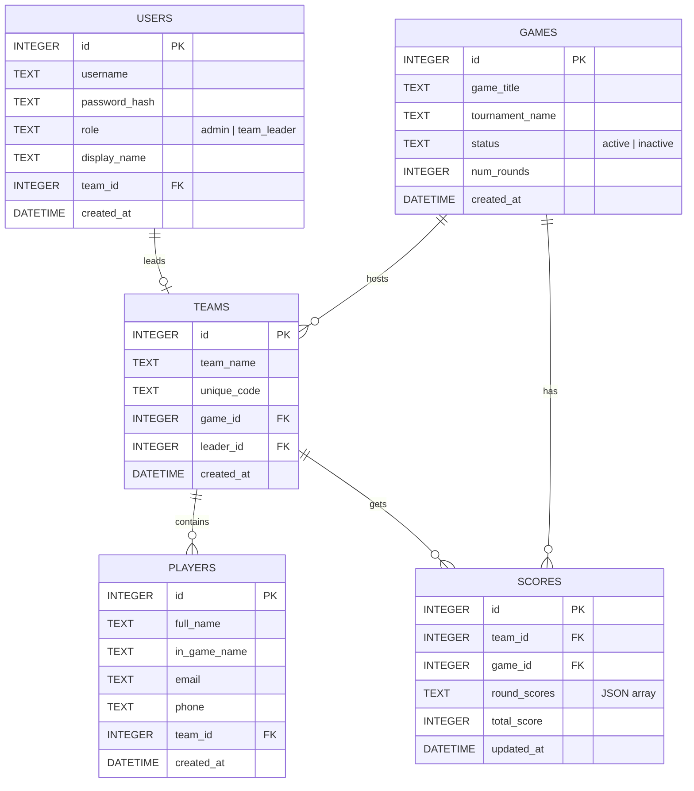

# ggBoard Project Analysis Report

An evaluation of the architecture, database design, feature implementation status, and next steps for the **ggBoard** Esports Event Management Web Platform.

---

## 1. Project Overview & Architecture

**ggBoard** is a full-stack web application designed to manage esports tournaments. It handles tournament configuration, player registrations, team management, and live leaderboards.

The repository follows a clean full-stack monorepo structure:
```
ggBoard/
├── backend/                  # Express REST API & SQLite DB
│   ├── config/               # DB connection (better-sqlite3)
│   ├── database/             # SQLite Schema & seeder
│   ├── middleware/           # RBAC & Error Handling middleware
│   ├── routes/               # API Router modules
│   └── server.js             # Entry point
└── frontend/                 # Vite + React Client
    ├── src/
    │   ├── context/          # Auth Context & localStorage integration
    │   ├── pages/            # React View Components
    │   └── utils/            # Axios instance with JWT interception
```

### Tech Stack Details
* **Backend**: Node.js & Express.js.
* **Database**: SQLite (via `better-sqlite3` with **Write-Ahead Logging (WAL)** enabled for fast concurrent read performance).
* **Security & Auth**: JWT-based session tokens with role-based access control (RBAC). Admin passwords hashed with `bcryptjs`.
* **Frontend**: React + Vite, styled using modern Vanilla CSS with a dark neon esports theme.
* **API Client**: Axios instance configured to attach JWT tokens to all requests automatically.

---

## 2. Database Schema Analysis

The database (`ggboard.db`) is structured with 5 core relational tables defined in `schema.sql`:



### Key Design Strengths
1. **Role Separation**: Credentials are consolidated in the `users` table, identifying whether the user is an `admin` or `team_leader`.
2. **Team Join System**: Every team is assigned a `unique_code` during registration, which players enter in the public client to add themselves to the team roster.
3. **Flexible Score Storage**: Scores are stored as a JSON array (`round_scores` in `scores` table), enabling dynamic round formats (e.g. 3 rounds, 5 rounds) without altering the database schema.
4. **Performance**: Indexes are created on all key foreign keys and lookup columns (`idx_teams_game_id`, `idx_players_team_id`, etc.) to optimize query times.

---

## 3. Checklist Completion Status Review

Based on a comparison of the `ggBoard_Checklist_updated.md` file and the actual implementation code:

| Phase | Description | Checklist State | Code State | Details |
|---|---|---|---|---|
| **Phase 1** | Project Setup & Foundation | ✅ Complete | Complete | Express server running, SQLite configured with WAL, DB seeded. |
| **Phase 2** | Authentication System | ✅ Complete | Complete | JWT generation, Admin / Leader logins, and RBAC middleware are active. |
| **Phase 3** | Landing Page | ⬜ Pending | **Partially Done** | `LandingPage.jsx` has design theme & nav routes. Checklist not updated. |
| **Phase 4** | Registration Flow | ⬜ Pending | **Done** | `CreateTeam.jsx` and `JoinTeam.jsx` are fully functional. Checklist not updated. |
| **Phase 5** | Admin Panel | ⬜ Pending | **Done** | `AdminDashboard.jsx` supports full CRUD on Games, Teams, Players, Scores and exports CSV. |
| **Phase 6** | Team Leader Panel | ⬜ Pending | **Skeleton Only** | **NEEDS WORK**: Backend routes are ready, but `LeaderDashboard.jsx` is just a placeholder mockup. |
| **Phase 7** | Public Scoreboard | ⬜ Pending | **Done** | `PublicScoreboard.jsx` fetches scores and displays ranked leaderboards. |
| **Phase 8** | Polish & Validation | ⬜ Pending | **Partially Done** | Error messages and API inputs are sanitized. Confirmations exist. |
| **Phase 9** | Testing | ⬜ Pending | **Needs Review** | Needs systematic verification across all user flows. |

---

## 4. Key Gaps & Recommendations

### 🔴 Critical Gap: Team Leader Console Mockup
The page [LeaderDashboard.jsx](file:///c:/Users/asus/Documents/GGBoard/frontend/src/pages/LeaderDashboard.jsx) only contains a greeting card and a logout button. It does not implement any of the capabilities listed in Phase 6 of the checklist:
- Displaying their Team Name, registered game/tournament, unique copyable Team Code.
- Displaying their roster of registered players in a table.
- Editing their own profile data.
- Removing a player from their roster (with a confirmation modal).

### 🟡 Minor Gap: Real-time Score Updates
The public scoreboard fetches scores on mount and when changing games. However, a live update mechanism (WebSockets or automatic polling) has not yet been implemented.

---

## 5. Next Steps Plan

To advance the project towards production-readiness, we should execute the following steps:

1. **Implement the Scoped Team Leader Console** in `LeaderDashboard.jsx` using the existing backend APIs:
   - Call `GET /teams/my` to retrieve the team details and player rosters.
   - Implement "Remove Player" calling `DELETE /players/:id` (which is already protected on the backend so team leaders can only delete their own players).
   - Implement "Update Team Details" and "Edit Profile".
2. **Update the Checklist** to accurately reflect completed steps.
3. **Verify and Test** all user flows (manual/automated).
